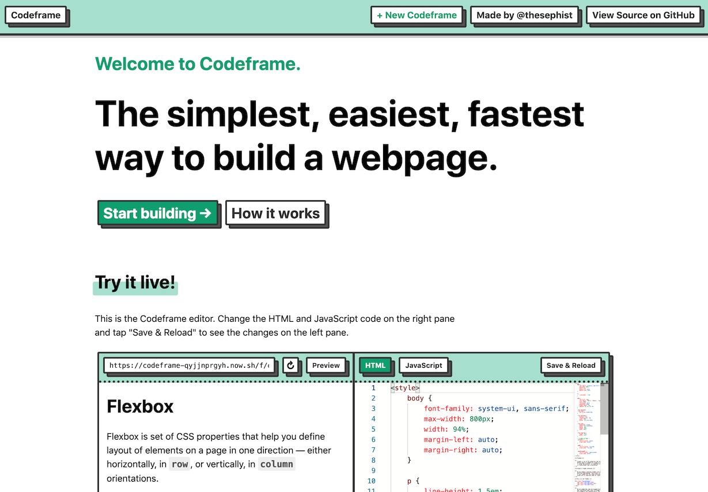

# Codeframe

Codeframe is the fastest, easiest way to build and deploy quick static webpages, and it's designed to be the best place to learn how to create things for the web, on the web. You can find it running live at codeframe.co.



## Why Codeframe?

👋 **It's easy to use.** Codeframe is built first and foremost for quick experiments and for people learning to code for the first time, so it eschews complexity and additional features for simplicity and ease of use.

🚀 **It's fast.** Your development environment should move at the speed of your ideas, and with no build tooling, there's no reason Codeframe can't be instantaneous. I built Codeframe to cut down the time from idea to sharable prototype as much as physically possible. Just open the editor, write code, and share in one click.

🛠 **It's open-source and fully inspectable.** Everything that runs Codeframe, from the backend stack to the JavaScript code behind the Codeframe editor, is open source and inspectable right in the browser. I think having readable source code in the delivered product makes a difference for people learning to code, and Codeframe prioritizes this over additional complexity and small efficiency gains with minified bundles and proprietary source.

### Why _not_ Codeframe?

If you don't specifically need something designed for speed or for students new to coding, there are other tools that might work better for you, with more features. [CodePen](https://codepen.io) is the classic in-browser web IDE with more powerful features and customization options; [CodeSandbox](https://codesandbox.io) is awesome for experimenting with projects with build / bundling steps, and [Repl.it](https://repl.it/languages/html) has an amazing suite of development tools for their HTML environment, including the ability to create additional files / folders and multiplayer, which allows for smooth real-time collaboration.

## Run your own Codeframe

Everything you need to run your own version of Codeframe is in this open-source repository. Here's how you can run your own version on Codeframe on your computer or server.

You'll need these tools:

- `git`, for copying the repository from GitHub to your computer. [Get Git here](https://git-scm.com).
- Node.js for running the Codeframe app, which is written in JavaScript for Node.js. [Download Node.js here](https://nodejs.org/en/).
- `npm` (or its alternative `yarn`) to install dependencies like Express. NPM typically comes with Node.js.
- A command line terminal, and basic familiarity with how to move around your computer in it with `ls`, `cd`, etc.

Once you have these tools installed and ready, the first step is to clone this git repository to your computer. Go to a directory where you'd like to setup Codeframe, and run

```sh
$ git clone https://github.com/thesephist/codeframe.git
```

(If you have SSH set up for git, and know how to use it, you can use the `git://` url instead. If you don't, don't worry about it.)

Now, `cd` into the new `codeframe` directory git just created, and you should see all the files in the Codeframe repository.

```sh
$ cd codeframe/
$ ls
src/    static/   docs/   README.md  LICENSE ...
```

Here, let's try starting Codeframe with Node.js using the command `npm start`.

```sh
$ npm start
...
Error: Cannot find module 'express'
    at Function.Module._resolveFilename (internal/modules/cjs/loader.js:603:15)
    ...
```

This means Node.js couldn't find `express`, a JavaScript library to build web servers that Codeframe depends on. Let's install dependencies like Express by running `npm install`, then try again.

```sh
$ npm install
...
$ npm start
Codeframe running on localhost:4556
```

You may notice that npm creates a new directory called `node_modules/`, where it'll install Codeframe's dependencies.

If you see the message `Codeframe running on localhost:4556`, this means you have Codeframe up and running on your computer. Go to your browser and open up the address [`http://localhost:4556`](http://localhost:4556). This should tell your browser to find the page running on [port](https://en.wikipedia.org/wiki/Port_(computer_networking)) 4556 (Codeframe's default port) on your computer, and load up the main page of Codeframe.

After you change any backend-service file (under `src/`), you can restart the server with `npm start` (Ctrl + C to end a running server) to see the changes take place. If you're editing frontend code, there's no need to restart -- just reload the page in the browser!

## How does Codeframe work?

If you're curious about the inner-workings of Codeframe, I'm building out a fully annotated version of the codebase available [here on GitHub Pages](https://thesephist.github.io/codeframe/) using a tool called [Litterate](https://github.com/thesephist/litterate). While that's a good place to look at how everything is implemented, this section provides a high-level overview of how the system is designed.

### Backend: Hash-based immutable database

All codeframes are (for now) a pair of files, an HTML file and a JavaScript file, which we can just treat as chunks of text. Codeframe stores all files, both HTML and JavaScript, in the same place, in the same way, in a way that can't be modified once they're saved. This is Codeframe's immutable, hash-based database.

When a user creates a new file or a new version of a file, the editor sends the file to the backend. The backend gets the file and [hashes](https://en.wikipedia.org/wiki/Hash_function) it (currently using SHA256) and uses the hash to create a short and practically unique filename for the file. The file is saved to a location in the backend (`db/` by default) with that hashed filename. This makes sure that, if we tried to save the same file multiple times, we'd effectively only save one file in the backend. Because this happens a lot in practice using Codeframe, this is efficient.

Each file is identified by its hash in this way, so using two hashes (one each for the HTML and JavaScript files of a Codeframe), we can define any unique Codeframe. This is how Codeframe works; each Codeframe's URL contains two hashes, one each for HTML and JavaScript. When you request a Codeframe, the backend finds files saved before using those hashes as filenames, and returns the files to the editor or to the browser for your viewing.

This hash-based database of files has a few advantages. The fact that each file is saved once and never overwritten means that any Codeframe, at any point in time, is completely characterized by its URL. Your changelog is effectively your browser history, and any Codeframe you share will stay exactly that version forever. This also means the backend service remains extremely simple -- it's a completely functional design with no side effects outside of the database, which is an immutable key-value store.

The currently implementation, which is just based on the filesystem, also falls short in some areas. Mainly, it uses the FS as the storage layer of the database. Since filesystems aren't designed to be used this way, in large numbers we may hit a scalability bottleneck where we'll have to switch to a different key-value store like Amazon's S3. We also currently store incremental changes to each file in a completely separate file in the database. This is also the way Git handles changes, but with Codeframe's usage, this may turn out to be massively inefficient. These arne't issues at the moment, but may become more important going forward, at which point we'll address them.

### Frontend: Embeddable, Torus-based editor

Codeframe's frontend user interface is built as a single [Torus](https://github.com/thesephist/torus) component, which is the Codeframe editor. This editor can run standalone, as it does in the full-screen editor view of any Codeframe, or it can be embedded as an `<iframe>` into certain allowed websites, like it is on the main page. Everything else you see on the frontend, including the rest of the home page, is simple, handwritten HTML, CSS, and JavaScript.

I chose Torus to build the frontend because (1) I wrote the library, so I know it inside-out and it's designed to fit my tastes, (2) it's fast and lightweight, just like Codeframe is designed to be, and (3) it makes prototyping very, very fast; Codeframe's v1.0 was built in 20 hours over 2 days, so fast prototyping was a priority while things like support for older browsers wasn't a core goal. It was also a good chance to let Torus stretch its legs and test it out in a production setting.

The entire editor is implemented in a single JavaScript file, in `static/js/main.js`, which you can read [here](https://thesephist.github.io/codeframe/static/js/main.js.html).

For the text editor inside Codeframe, I'm using [Monaco](https://microsoft.github.io/monaco-editor/), a text editor built for the browser from Microsoft's Visual Studio Code editor. It's fast, sleek, and works very well on desktop browsers. Monaco's mobile support is lacking, but this is hard to address without adding a bunch of shims to Monaco or shipping a custom text editor, which is at most a long-term roadmap item for Codeframe.

The preview pane in the editor is a simple `<iframe>` that opens a view of the generated HTML + JS page for the Codeframe, so you can see it as it updates live. Today, it operates completely independently from the editor, but in the future we may add some communication between the two to make fancier features possible, like live updates.

### A note on frontend dependencies

Codeframe's editor only has two dependencies: Torus and the Monaco editor. For development speed, Codeframe currently ships both dependencies as simple `<script>` tags in the editor HTML that points to versions of the NPM packages on Unpkg. In the future, we may bundle our own versions of Torus and Monaco, but so far Unpkg has proven reliable enough.

## How to contribute (beginners welcome 👋)

Codeframe is open-source for two reasons.

1. To share how it works inside, so anyone curious can learn from it, and
2. To allow anyone to contribute improvements and templates to Codeframe.

### Improve Codeframe itself

To the second point, there are lots of corners of Codeframe that are rough and can use some polish. If you're an experienced JavaScript developer and want to see Codeframe improve, my DM's and PR's are open.

### Add explanations and clarifying comments or notes

But more importantly, I made Codeframe open-source with the intention that newcomers to web programming would be able to learn from reading Codeframe's source. If you come across a bit of code in the repository that confuses you, feel free to file an issue or add a pull request for better explanations, clarifications, or better code.

### Add starter templates

A key part of Codeframe is its library of friendly starter templates. It's a small set for now, but I want to grow this into a repository of high-quality sample Codeframes that allow people to jump in and learn about new web technologies easily.

If you have Codeframes or samples you'd like to include on the front page of Codeframe as another starter template, add a file under `starter_fixtures/` and inside `const STARTER_FIXTURES` in `src/models.js`, and file a pull request! Starter templates set up this way are set up in the database at deployment time, ensuring that every running version of Codeframe has it set up.

## Support

If you enjoy using Codeframe and want to support what I make going forward, please consider making a donation to Codeframe through [PayPal](https://www.paypal.me/thesephist) or [Venmo](https://venmo.com/thesephist) 🙏.

Alternatively, please consider donating to some of the best nonprofit organizations doing great work in the CS education space, [KhanAcademy](https://www.khanacademy.org/donate), [Hack Club](https://hackclub.com/donate/), and [StuTech](https://grants.stutech.org).
